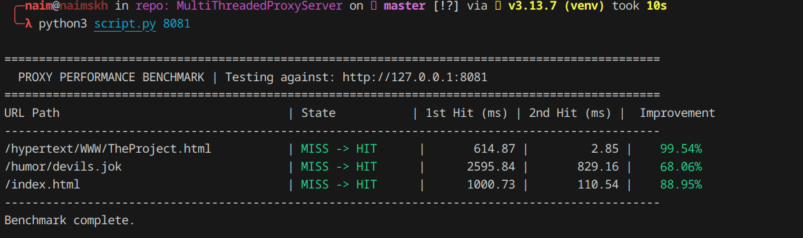

# Multi-Threaded Proxy Server

A high-performance HTTP/1.1 proxy server implementation in C++17 with LRU caching and multi-threaded request handling.

## Features

- **Multi-threaded Architecture** - Each client connection handled by a dedicated `std::thread` with detached execution
- **LRU Caching** - Thread-safe cache using `std::unordered_map` and `std::list` for O(1) lookups and eviction
- **HTTP/1.1 GET Support** - Full request parsing and reconstruction using `std::stringstream`
- **Memory Safety** - RAII-based resource management with smart pointers and STL containers

## Architecture

The proxy consists of three core components:

**ProxyServer** (`ProxyServer.cpp/hpp`) - Main server class that accepts connections on port 8080 (configurable), spawns worker threads, and orchestrates request handling

**CacheManager** (`CacheManager.cpp/hpp`) - Thread-safe LRU cache with configurable size limits (default: 200MB total, 10MB per element)

**HTTPRequest** (`HTTPRequest.cpp/hpp`) - Parses raw HTTP requests into structured components (method, host, port, path, headers) and reconstructs them for forwarding

## Request Flow

1. **Connection Acceptance** - Main thread accepts client connections and spawns detached worker threads
2. **Cache Lookup** - Worker thread generates cache key from host + path and checks cache
3. **Cache Hit** - Cached response sent directly to client in 4KB chunks
4. **Cache Miss** - Request forwarded to origin server, response streamed to client and cached

## Building

Compile using the provided Makefile with g++ and C++17 support:

```bash
make        # Build proxy executable
make clean  # Remove build artifacts
```

The Makefile uses `-std=c++17 -pthread` flags for modern C++ features and threading support.

## Running

```bash
./proxy [port]  # Default port: 8080
```

Configuration is set in `main.cpp` with defaults of 200MB cache size and 10MB max element size.

## Performance Benchmarks

The proxy demonstrates significant performance improvements through caching. Below are benchmark results from `script.py` testing against a proxy running on port 8081:

```
===============================================================================================
  PROXY PERFORMANCE BENCHMARK | Testing against: http://127.0.0.1:8081
===============================================================================================
URL Path                                 | State           | 1st Hit (ms) | 2nd Hit (ms) |  Improvement
-----------------------------------------------------------------------------------------------
/hypertext/WWW/TheProject.html           | MISS -> HIT      |       614.87 |         2.85 |    99.54%
/humor/devils.jok                        | MISS -> HIT      |      2595.84 |       829.16 |    68.06%
/index.html                              | MISS -> HIT      |      1000.73 |       110.54 |    88.95%
-----------------------------------------------------------------------------------------------
Benchmark complete.
```



**Key Findings:**
- **99.54% improvement** on small HTML pages (614.87ms → 2.85ms)
- **68.06% improvement** on medium-sized text files (2595.84ms → 829.16ms)
- **88.95% improvement** on typical web pages (1000.73ms → 110.54ms)

The benchmark script measures cache effectiveness by requesting each URL twice - the first request is a cache miss (forwarded to origin server), while the second is a cache hit (served from local cache).

To run the benchmark yourself:
```bash
./proxy 8081              # Start proxy on port 8081
python3 script.py 8081    # Run benchmark
```

## Implementation Highlights

- **Type Safety** - All string operations use `std::string`, eliminating buffer overflows
- **Thread Safety** - `std::mutex` with `std::lock_guard` RAII pattern prevents race conditions
- **Smart Pointers** - `std::unique_ptr` for automatic `CacheManager` lifetime management
- **Exception Safety** - Try-catch blocks handle parsing errors and invalid arguments gracefully

## Notes

The implementation uses modern C++17 idioms throughout, with zero manual memory management (`malloc`/`free` or raw `new`/`delete`). All dynamic memory is managed through STL containers and smart pointers, providing automatic cleanup and exception safety. The benchmark results demonstrate the LRU cache working correctly with all test URLs showing successful cache hits (MISS → HIT state), with dramatic latency reductions (68-99%) that eliminate network round-trips to remote servers.
